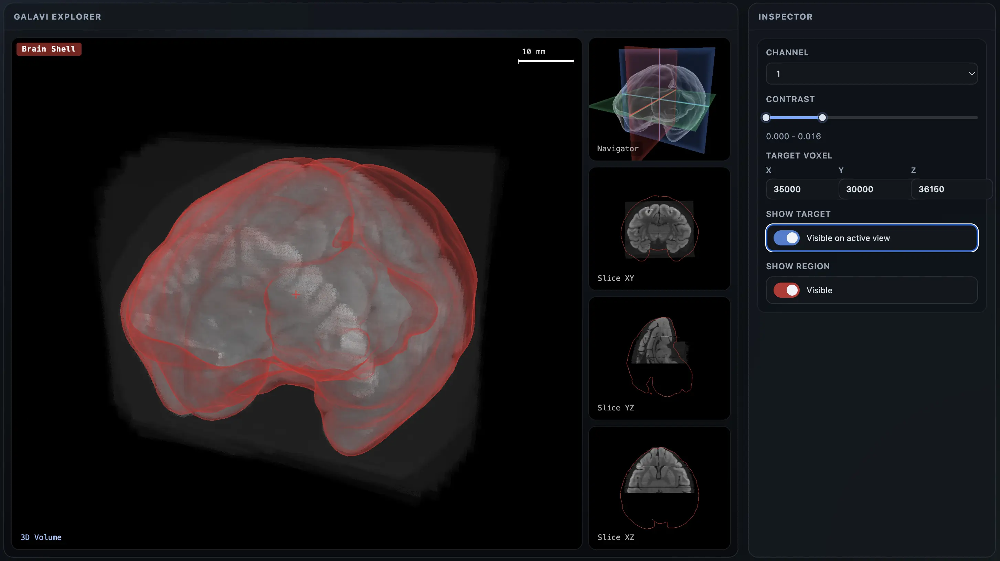

# Galavi

Galavi is a WebGPU visualization library for shared-state scientific viewers. It renders volume, slice, surface, shape, and related data types through one state model and a small set of pluggable building blocks.



## Features

- **High-level `Viewer` API** — `createViewer(element, config)` gives you a complete scientific viewer in one call: dataset session, modes, channels, camera fit, controls/tools, and loading status from a single JSON-serializable `ViewerConfig`.
- **`openDataset` dataset-kind registry** — format-neutral dataset contract (pyramid, physical space, channels, capabilities); kinds self-register via `registerDataset` (`"image"` comes from the `galavi/ome-zarr` subpath, `"mesh"` is built in).
- WebGPU-native rendering for multi-view scientific scenes.
- Shared, serializable `State` model — physical space, layers, exploration — diffable across view layouts.
- Tile-based multi-resolution loading for large OME-Zarr and similar pyramidal datasets, with an automatic bounded volume tile-budget policy.
- Built-in views: `volume` (3D perspective), `slice` (2D ortho), `navigator` (3D overview).
- Built-in controls: `orbit`, `fly`, `panzoom` — pure reducers, view-local.
- Automatic physical-scale resolution selection with coarse-first loading and dynamic visible storage chunks.
- Built-in overlays: `crosshair`, `ruler`, `roiselector`, `magnifier-2d`, `magnifier-3d`, `foldablepanel` — bound to a live view, with typed option bags (`OverlayOptionsMap`).
- Built-in layers: volume, slice, surface, shape, points, network, segmentation, vectors, tracks.
- HCS support via the `galavi/ome-zarr` subpath's typed `openOMEZarrPlate` (plate/well/field hierarchy with ready-to-open dataset configs).
- FUI overlay theme, customizable via `ViewerConfig.theme` and consumable by apps through `--galavi-*` CSS custom properties.
- Extensible registries for layers, views, controls, and overlays — add your own without forking.
- Framework-agnostic canvas mounting; works with Vue, React, vanilla, etc.

## Install

```bash
npm install galavi zarrita
# or
bun add galavi zarrita
```

## Quickstart

Two imports, one call — a complete viewer against an OME-Zarr store:

```ts
import { createViewer } from "galavi";
import "galavi/ome-zarr"; // registers the "image" dataset kind (OME-Zarr)

const viewer = await createViewer("#app", {
  dataset: { type: "image", source: "https://server/data.zarr" },
});
```

Every config key has an imperative equivalent: `viewer.mode = "volume"`,
`viewer.projection = "mip"`, `viewer.channel(1).configure({ contrast: [0.02, 0.2] })`,
`viewer.tool("ruler").enable()`, `await viewer.open(dataset)`.

Use the low-level **`createViewerEngine`** API instead when you need what the
Viewer does not own: arbitrary multi-view composition, custom registered
layers/controls/overlays/views, non-image layers, or explicit scene-`State`
serialization. `viewer.engine` is the escape hatch for one-off advanced
operations. See [DESIGN.md](./DESIGN.md) for the layering and ownership model.

## References

- **Documentation:** [i-z-j.github.io/galavi-docs](https://i-z-j.github.io/galavi-docs/)
- **Live examples:** [i-z-j.github.io/galavi-examples](https://i-z-j.github.io/galavi-examples/)
- **Source:** [github.com/i-z-j/galavi](https://github.com/i-z-j/galavi)

## License

GPL-3.0
